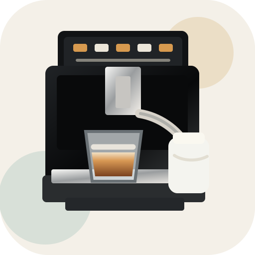

# Polaris PACM Coffee MQTT

  

Home Assistant custom integration for Polaris PACM-2081AC revision 280 coffee machines connected through local MQTT.

This integration is focused only on the coffee machine workflow:

- reads `program_data` recipes from MQTT;
- exposes drink selection and editable recipe controls;
- temporarily writes a modified recipe before start;
- starts the selected drink with `control/mode`;
- restores the original recipe after start.

## Supported Device

- Polaris PACM-2081AC, device type / revision `280`

## Requirements

- Home Assistant with the built-in MQTT integration configured.
- The coffee machine must publish its local MQTT topics to your broker.
- The integration expects Polaris topics such as:
  - `polaris/<device>/state/mac`
  - `polaris/<device>/state/devtype`
  - `polaris/<device>/state/program_data/<index>`

For older topic layouts, manual setup can be used with a device path like `280/<device_id>`.

## Installation With HACS

1. Open HACS.
2. Open custom repositories.
3. Add this repository URL.
4. Choose category `Integration`.
5. Install `Polaris PACM Coffee MQTT`.
6. Restart Home Assistant.
7. Add the integration from Settings -> Devices & services.

## Manual Installation

Copy `custom_components/polaris_coffee` into your Home Assistant `custom_components` directory and restart Home Assistant.

## Entities

The integration creates:

- switches: power, child lock;
- select controls: drink, current user, coffee strength, preinfusion, extraction, temperature;
- number controls: coffee volume, milk foam, hot water;
- buttons: start, stop;
- binary sensor: local network availability.

## Notes

The integration currently supports the known recipe layout for revision `280`. If another firmware revision stores recipes differently, it may need a separate offset map.

## Releases

Tagged releases are built automatically by GitHub Actions. To publish a new build, update the integration version in `custom_components/polaris_coffee/manifest.json`, create a tag like `v0.1.1`, and push it to GitHub.
